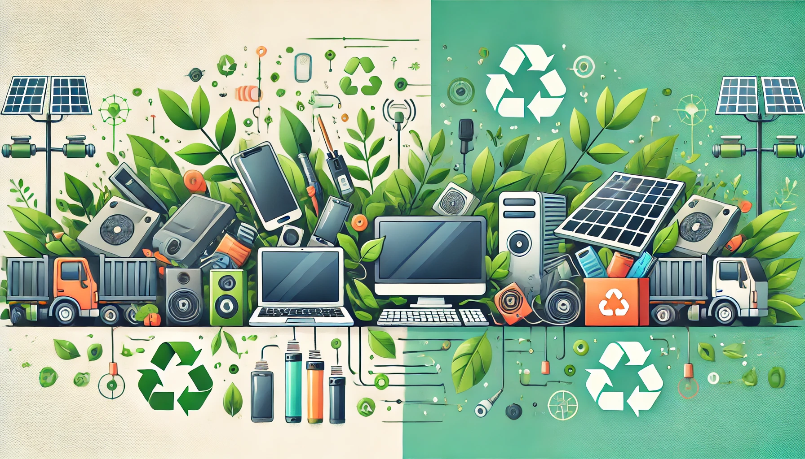

# Proteccion mediambiental
## Indice

1. [Introduccion](introduccion.md)
2. [Principales amenazas al medio ambiente](amenazas.md)
3. [Concepto y objetivos de la protección ambiental](concepto.md)
4. [Acuerdos internacionales para la protección ambiental](acuerdos.md)
5. [Políticas y normativas medioambientales en Europa](normativa.md)
6. [Evaluación y gestión del impacto ambiental](evaluacionmedioambiental.md)
---

---

[Autores](autores.md)
