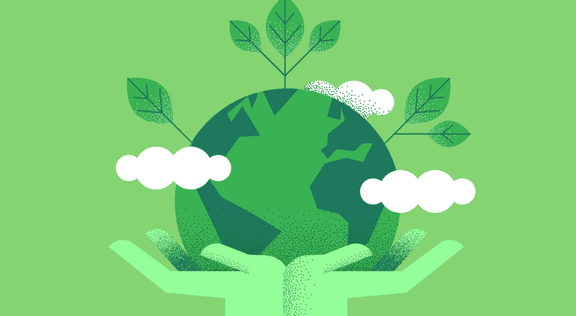

# Introduccion

En la actualidad, el avance de las tecnologías de la información y la comunicación ha transformado profundamente la manera en que trabajamos, nos comunicamos y vivimos. 
Sin embargo, este progreso no está exento de consecuencias para el medio ambiente.

La producción masiva de dispositivos electrónicos, el crecimiento de los residuos informáticos y la práctica de la obsolescencia programada generan desafíos ambientales cada vez más apremiantes. 
Ante esta problemática, surge la necesidad de adoptar prácticas sostenibles y responsables en el ámbito de la informática.

---

---
